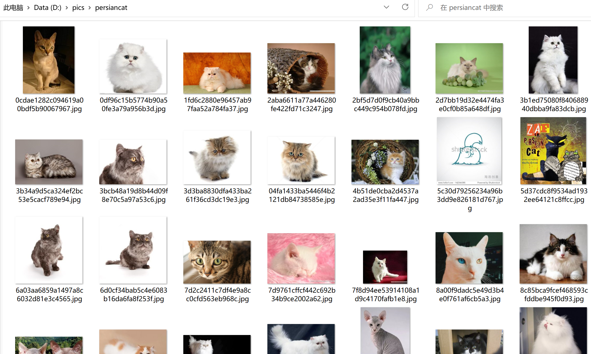

# simpleimagescrawler
simple image crawler from baidu search engine
1. set headers with your keys and values from your browser.
2. tmp_file_name = <image path to be saved> ex: tmp_file_name = 'D:/pics/persiancat/%s.jpg' % uuid_str
3. run downloadimages.py
4. input your search key: ex: Please enter your search key:persian cat
5. set your start page no.: ex: start page no.:1
6. set your total pages to be searched: ex: no. of pages to be searched:3
7. downloading
8. "images download is completed." when python finished images crawler program.
9. images downloaded to your path:
